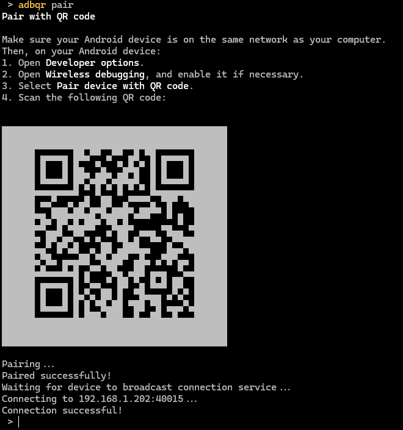
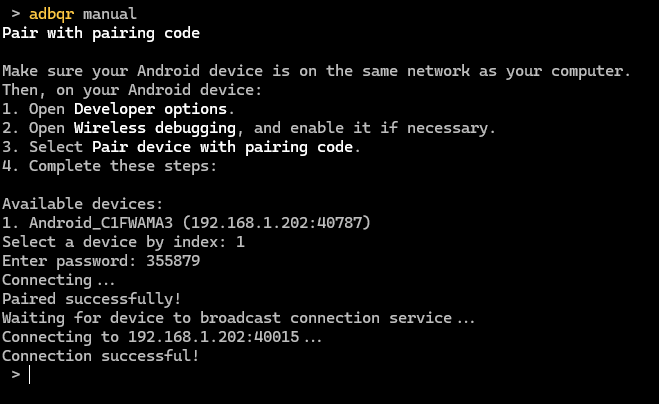

# adbqr (Python)

adbqr is a simple command line tool to manage wireless ADB connections easily, like in Android Studio.

This is a Python fork/port of the original Rust project: [soxfox42/adbqr](https://github.com/soxfox42/adbqr). It provides seamless installation and dependency management for Python users.

## Installation

Requires Python 3.10+.

First, clone this repository and navigate into the directory:

```bash
git clone https://github.com/OzanKutlar/adbqr-py.git
cd adbqr-py
pip install .
# or for development:
pip install -e .
```

During your first run, the CLI will automatically detect the `adb` executable in your `PATH` or current directory. If it isn't found, you will be prompted to provide the full path to `adb`.

## Usage

After installation, the `adbqr` command is available in your terminal. 

```bash
# Default command: initiates QR code pairing.
adbqr 

# Explicitly initiate QR code pairing.
adbqr pair

# Initiate manual pairing via pairing code.
# This is still faster than a regular `adb pair` command as the tool automatically 
# detects phones on the network that have entered into "pair with code" mode.
adbqr manual

# Connect to an already paired device on the network.
adbqr connect
```

**Pairing Instructions:**
Make sure your Android device is on the same network as your computer.
1. On your Android device, open **Developer options**.
2. Open **Wireless debugging**, and enable it if necessary.
3. Select the respective pairing option based on your command (QR code or pairing code).
4. Follow the on-screen terminal instructions.

## Screenshots



